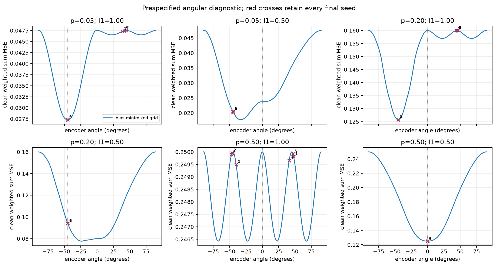

# Focused training-to-geometry bridge: numerical results

Run date: 6 October 2026. This report describes the prespecified test only. It does not claim global geometry optimality, a general load boundary, novelty, adversarial robustness or conference acceptance.

## What was tested

Six two-feature/one-dimension independent-Bernoulli cases, fixed encoder energy one, free ReLU biases, importance-weighted population reconstruction training. All six seeds per case ran for exactly 4,000 projected Adam steps. All final iterates and optimizer shortcomings are retained. A fixed 361-angle grid plus two explicit pair angles supplied a separate numerical landscape diagnostic. Both actual-decoder and centered-midpoint detection were evaluated at all five prespecified code-noise levels. No extra seed, local refinement or optimizer retry was run.

## Verification

- Pretraining checks passed: 48 weighted-gradient checks (maximum absolute discrepancy 4.75e-09); 108 bias-minimum checks (5.55e-17); independent Gaussian quadrature (6.66e-16).
- All 163 archived file hashes match. Independent direct reconstruction loss discrepancy is at most 0. Final checkpoints agree exactly.
- Total run time 68.06 seconds; training time 60.72 seconds. No nonfinite training failure occurred.

## Clean reconstruction and optimizer results

Losses below are importance-weighted **sums**. The numerical grid comparison is the best candidate among the prespecified angles, not a theorem about all geometries.

| p | Importance | Grid diagnostic loss | Mono retaining 0 / 1 | Final trained loss range | Loss-stability failures |
|---|---|---:|---:|---:|---:|
| 0.05 | [1.0, 1.0] | 0.027303150 | 0.047500000 / 0.047500000 | 0.027303150–0.047494522 | 1/6 |
| 0.05 | [1.0, 0.5] | 0.017742988 | 0.023750000 / 0.047500000 | 0.020322749–0.020482173 | 2/6 |
| 0.2 | [1.0, 1.0] | 0.125714286 | 0.160000000 / 0.160000000 | 0.125714286–0.159992413 | 0/6 |
| 0.2 | [1.0, 0.5] | 0.077752872 | 0.080000000 / 0.160000000 | 0.094134487–0.094259909 | 3/6 |
| 0.5 | [1.0, 1.0] | 0.246425565 | 0.250000000 / 0.250000000 | 0.249490084–0.249959892 | 3/6 |
| 0.5 | [1.0, 0.5] | 0.125000000 | 0.125000000 / 0.250000000 | 0.125000000–0.125000000 | 0/6 |

**27/36 runs pass the prescribed loss-stability diagnostic; 9/36 fail. Passing this diagnostic does not imply stationarity or global convergence.**

- For equal importance at p=0.05 and 0.20, three seeds approach antipodal geometry and three remain on the same-sign branch. The outcomes are seed dependent.
- For importance [1,0.5] at p=0.05 and 0.20, all six projected-Adam outcomes remain near equal-amplitude antipodal geometry even though the grid supplies lower clean losses at unequal amplitudes. Tangent gradient norms remain roughly 0.024–0.025 and 0.091. These are optimizer shortcomings; the outcome is not evidence that equal-amplitude geometry is optimal.
- For equal importance at p=0.50, grid minima occur at several unequal-amplitude angles. All final trained losses remain above that grid diagnostic.
- For importance [1,0.5] at p=0.50, all six runs approach the code retaining feature 0 and match clean loss 0.125. The grid also selects that retention code.
- Reoptimizing biases for fixed final W changes the largest loss by only 4.95e-07. The principal observed gaps therefore concern encoder geometry/optimization rather than an omitted fixed-W bias improvement.

The lines show exact bias-minimized loss at the stated angular candidates. Every seed is plotted as its actual final weighted loss at its final angle. The two vertical dotted reference angles are equal antipodal (-45 degrees) and monosemantic retention of feature 0 (0 degrees). No axis range clips a computed objective value.

## Noisy detection: every seed, both detector definitions

The table gives min–max **across all six final seeds**; no favorable seed is selected. The baseline is chosen by clean reconstruction objective (feature 0 retention for unequal importance; the equal-importance baselines are tied and have equal aggregate detection error). All errors are weighted sums, not means. Full per-feature FP/FN, MSE and both baselines appear in `../run_v1/risks.csv`.

| p | Importance | Detector | sigma | Final trained weighted error range | Clean-preferred mono error |
|---|---|---|---:|---:|---:|
| 0.05 | [1,1.0] | actual_decoder | 0.00 | 0.005000–0.095000 | 0.050000 |
| 0.05 | [1,1.0] | actual_decoder | 0.05 | 0.025696–0.094830 | 0.050000 |
| 0.05 | [1,1.0] | actual_decoder | 0.15 | 0.042770–0.094995 | 0.050429 |
| 0.05 | [1,1.0] | actual_decoder | 0.30 | 0.070936–0.110930 | 0.097790 |
| 0.05 | [1,1.0] | actual_decoder | 0.60 | 0.289185–0.307859 | 0.252328 |
| 0.05 | [1,1.0] | centered_midpoint | 0.00 | 0.005000–0.095000 | 0.050000 |
| 0.05 | [1,1.0] | centered_midpoint | 0.05 | 0.005000–0.095000 | 0.050000 |
| 0.05 | [1,1.0] | centered_midpoint | 0.15 | 0.035958–0.103616 | 0.050429 |
| 0.05 | [1,1.0] | centered_midpoint | 0.30 | 0.270931–0.274596 | 0.097790 |
| 0.05 | [1,1.0] | centered_midpoint | 0.60 | 0.561746–0.570001 | 0.252328 |
| 0.05 | [1,0.5] | actual_decoder | 0.00 | 0.003750–0.003750 | 0.025000 |
| 0.05 | [1,0.5] | actual_decoder | 0.05 | 0.018369–0.019307 | 0.025000 |
| 0.05 | [1,0.5] | actual_decoder | 0.15 | 0.031598–0.032093 | 0.025429 |
| 0.05 | [1,0.5] | actual_decoder | 0.30 | 0.053139–0.053204 | 0.072790 |
| 0.05 | [1,0.5] | actual_decoder | 0.60 | 0.217488–0.217970 | 0.227328 |
| 0.05 | [1,0.5] | centered_midpoint | 0.00 | 0.003750–0.003750 | 0.025000 |
| 0.05 | [1,0.5] | centered_midpoint | 0.05 | 0.003750–0.003750 | 0.025000 |
| 0.05 | [1,0.5] | centered_midpoint | 0.15 | 0.026669–0.026978 | 0.025429 |
| 0.05 | [1,0.5] | centered_midpoint | 0.30 | 0.204828–0.205711 | 0.072790 |
| 0.05 | [1,0.5] | centered_midpoint | 0.60 | 0.426845–0.427521 | 0.227328 |
| 0.2 | [1,1.0] | actual_decoder | 0.00 | 0.080000–0.320000 | 0.200000 |
| 0.2 | [1,1.0] | actual_decoder | 0.05 | 0.080009–0.319926 | 0.200000 |
| 0.2 | [1,1.0] | actual_decoder | 0.15 | 0.108939–0.319999 | 0.200429 |
| 0.2 | [1,1.0] | actual_decoder | 0.30 | 0.215473–0.332271 | 0.247790 |
| 0.2 | [1,1.0] | actual_decoder | 0.60 | 0.444691–0.481204 | 0.402328 |
| 0.2 | [1,1.0] | centered_midpoint | 0.00 | 0.080000–0.320000 | 0.200000 |
| 0.2 | [1,1.0] | centered_midpoint | 0.05 | 0.080013–0.319999 | 0.200000 |
| 0.2 | [1,1.0] | centered_midpoint | 0.15 | 0.174534–0.320524 | 0.200429 |
| 0.2 | [1,1.0] | centered_midpoint | 0.30 | 0.383394–0.383883 | 0.247790 |
| 0.2 | [1,1.0] | centered_midpoint | 0.60 | 0.587049–0.599788 | 0.402328 |
| 0.2 | [1,0.5] | actual_decoder | 0.00 | 0.060000–0.060000 | 0.100000 |
| 0.2 | [1,0.5] | actual_decoder | 0.05 | 0.060006–0.060006 | 0.100000 |
| 0.2 | [1,0.5] | actual_decoder | 0.15 | 0.081583–0.081683 | 0.100429 |
| 0.2 | [1,0.5] | actual_decoder | 0.30 | 0.161494–0.161586 | 0.147790 |
| 0.2 | [1,0.5] | actual_decoder | 0.60 | 0.333472–0.333511 | 0.302328 |
| 0.2 | [1,0.5] | centered_midpoint | 0.00 | 0.060000–0.060000 | 0.100000 |
| 0.2 | [1,0.5] | centered_midpoint | 0.05 | 0.060010–0.060010 | 0.100000 |
| 0.2 | [1,0.5] | centered_midpoint | 0.15 | 0.130616–0.130852 | 0.100429 |
| 0.2 | [1,0.5] | centered_midpoint | 0.30 | 0.287600–0.287859 | 0.147790 |
| 0.2 | [1,0.5] | centered_midpoint | 0.60 | 0.449651–0.449809 | 0.302328 |
| 0.5 | [1,1.0] | actual_decoder | 0.00 | 0.500000–0.500000 | 0.500000 |
| 0.5 | [1,1.0] | actual_decoder | 0.05 | 0.500308–0.506644 | 0.500000 |
| 0.5 | [1,1.0] | actual_decoder | 0.15 | 0.500013–0.500481 | 0.500429 |
| 0.5 | [1,1.0] | actual_decoder | 0.30 | 0.509231–0.509542 | 0.547790 |
| 0.5 | [1,1.0] | actual_decoder | 0.60 | 0.619360–0.620223 | 0.702328 |
| 0.5 | [1,1.0] | centered_midpoint | 0.00 | 0.500000–0.500000 | 0.500000 |
| 0.5 | [1,1.0] | centered_midpoint | 0.05 | 0.500000–0.500000 | 0.500000 |
| 0.5 | [1,1.0] | centered_midpoint | 0.15 | 0.500001–0.500001 | 0.500429 |
| 0.5 | [1,1.0] | centered_midpoint | 0.30 | 0.509226–0.509430 | 0.547790 |
| 0.5 | [1,1.0] | centered_midpoint | 0.60 | 0.619356–0.620167 | 0.702328 |
| 0.5 | [1,0.5] | actual_decoder | 0.00 | 0.125000–0.250000 | 0.250000 |
| 0.5 | [1,0.5] | actual_decoder | 0.05 | 0.250000–0.250000 | 0.250000 |
| 0.5 | [1,0.5] | actual_decoder | 0.15 | 0.250429–0.250429 | 0.250429 |
| 0.5 | [1,0.5] | actual_decoder | 0.30 | 0.297790–0.297790 | 0.297790 |
| 0.5 | [1,0.5] | actual_decoder | 0.60 | 0.452328–0.452328 | 0.452328 |
| 0.5 | [1,0.5] | centered_midpoint | 0.00 | 0.250000–0.250000 | 0.250000 |
| 0.5 | [1,0.5] | centered_midpoint | 0.05 | 0.250000–0.250000 | 0.250000 |
| 0.5 | [1,0.5] | centered_midpoint | 0.15 | 0.250429–0.250429 | 0.250429 |
| 0.5 | [1,0.5] | centered_midpoint | 0.30 | 0.297790–0.297790 | 0.297790 |
| 0.5 | [1,0.5] | centered_midpoint | 0.60 | 0.452328–0.452328 | 0.452328 |

**Decoder choice materially changes the comparison.** For the fixed equal-amplitude antipodal code with optimal clean biases, at p=0.05 and sigma=0.30 actual-decoder sum error is 0.070936 versus mono 0.097790, while the centered-midpoint detector gives 0.274245 for that same code. At p=0.20 these errors are 0.215473 versus mono 0.247790, and midpoint 0.383883. The midpoint diagnostic cannot be silently substituted for the trained decoder.

Clean reconstruction MSE and thresholded feature detection are different objectives. For p=0.05, importance [1,0.5], the grid-best clean code has actual-decoder clean weighted detection error 0.0275, worse than the fixed antipodal code's 0.00375 despite its better clean reconstruction MSE. Thus decreasing training loss need not decrease this classification metric.

### Material zero-noise rounding caveat

At p=0.50, importance [1,0.5], the nearly dropped second encoder weight has magnitude around 1e-16 and its bias is within float64 rounding of 0.5. Algebraically equivalent strict comparisons can disagree in floating point: `Gb > 0.5-bias` versus `ReLU(Gb+bias)>0.5`. The raw primary algebraic-threshold results are retained, but their zero-noise variations (weighted error 0.125 or 0.25) must not be interpreted as robust recovery of the dropped feature. The direct float64 comparison is separately recorded in `zero_noise_float64_decoder_comparison.csv`. At nonzero tested noise, these trained aggregate risks agree with the retained-feature baseline. No weights were snapped to zero and no raw outputs were replaced.

## What this supports and what remains unresolved

The fixed-W bias computation and conditional noisy-risk evaluation pass the numerical checks. The experiment exposes the importance of decoder thresholds and supplies evidence that importance changes the preferred clean geometry. It does **not** establish that the prescribed training solver reliably reaches that geometry; multiple failures and nonstationary stable trajectories were observed.

The independent mathematical/teacher review must determine which optimality statements can actually be proved. A grid minimum cannot be called a global theorem. The smallest warranted next action is to review the training-to-geometry derivation and the coordinatewise Adam/projection behavior. The present run stops here. Any alternative optimizer or tighter geometric test requires a new bounded, explicitly recorded protocol.
