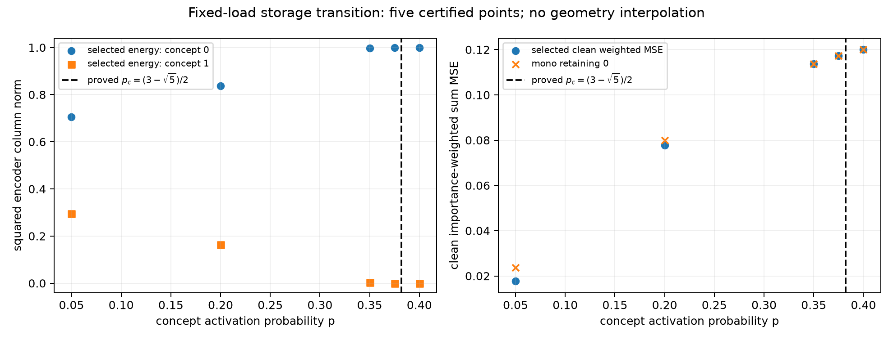
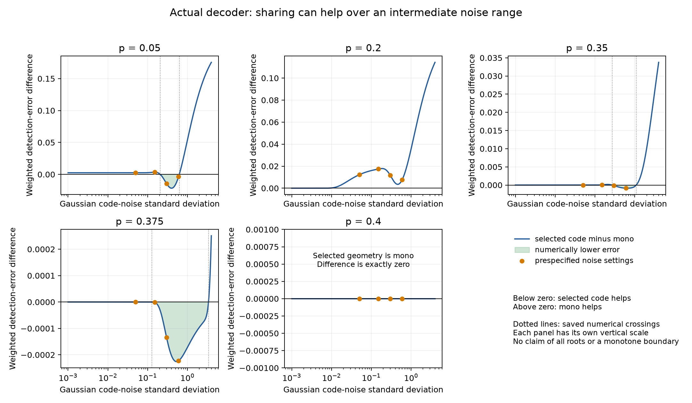

# Project 1: frequency-dependent storage and noisy detection

6 October 2026. This continues the monosemanticity / superposition-to-robustness project using the existing planted-concept model. It contains an analytic clean-storage transition, certified selected geometries, noisy-risk calculations, raw records and independent reviews. No new model family or training campaign was introduced.

## The question in plain language

Suppose a model has room for one direction but two concepts to reconstruct. One concept is twice as important as the other. When should clean training use the same direction to store both, and when should it give all capacity to the important concept? Once training has selected the code, when does that choice help or hurt noisy concept detection?

These are separate questions. A representation can reconstruct a concept more accurately in squared error while never crossing the threshold used to detect its presence.

## Model, assumptions and connection to the project

Independent bits b1,b2 have common activation probability p. The row encoder w has squared norm one and one code dimension; the tied decoder is ReLU(w^T w b+beta), with free biases. Training minimizes the exact population sum MSE1+MSE2/2. Corruption adds scalar zero-mean Gaussian code noise of standard deviation sigma. Actual detection uses the strict trained decoder rule reconstruction>.5.

The encoder Gram matrix describes storage and interference. The new step connects the clean objective to the selected geometry before using that geometry to calculate risk. All resources, training assumptions, detector definitions and baseline choices are explicit. This is average Gaussian-noise robustness under the declared distribution; it is not an adversarial guarantee or an AI-safety evaluation.

The [protocol](protocol.md) was saved before Stage A; the [finite verification protocol](verification_protocol.md) was saved after its prediction and before numerical execution. The broader [literature audit](../literature_review/novelty_audit.md) remains the novelty context. This work makes no claim that an absence of prior work or ICML acceptance has been established.

## Proved clean-storage transition

The [derivation](math/derivation.md) and [independent mathematical review](math/teacher_review.md) establish

\[
p_c=\frac{3-\sqrt5}{2}\approx0.38196601125.
\]

- For 0<p<pc, every global clean optimum stores both concepts, with opposite relative encoder signs.
- For pc<=p<=.5, retaining the important concept alone is globally optimal; the loss is p(1-p)/2. Equality belongs to this mono regime.

The theorem covers both signs, both norm/importance orderings and competing nonconvex bias minima. The local mono-stability threshold is also the global storage threshold. It does not assert a unique explicit sharing geometry for every p below pc. The student checked 15 symbolic identities/inequalities and the independent teacher checked 25. The global proof is the branch comparison, not those checks or sampled points alone.

In the original convention sparsity is s=1-p: clean sharing is favored for s>(sqrt(5)-1)/2. This is a **clean allocation boundary**, not automatically the noise-robustness boundary.

## Fixed numerical verification

Five activation probabilities were specified: .05,.20,.35,.375,.40. Four sharing optima were globally certified by exact rational finite-branch/root comparisons; .40 uses the reviewed mono theorem. Both mono retention controls were retained, and the primary mono control was selected by clean loss rather than noisy performance. No new optimizer run was needed for this population-selection calculation.

| p | Encoder energy in weak concept | Selected clean weighted MSE | Mono clean weighted MSE |
|---|---:|---:|---:|
| .05 | .295373681287 | .017742880541 | .023750000000 |
| .20 | .163490565429 | .077752082516 | .080000000000 |
| .35 | .002595127216 | .113740582191 | .113750000000 |
| .375 | .000121567823 | .117187402718 | .117187500000 |
| .40 | 0 | .120000000000 | .120000000000 |

The small near-transition improvements are genuine but small: about 9.42e-6 and 9.73e-8 in weighted MSE. The storage figure shows discrete certified points; it does not interpolate a continuous selected-geometry solution.



## Noise comparison and multiple crossings

The [full numerical report](toy/results.md) defines Delta=selected weighted detection error minus mono weighted detection error. Below zero favors the selected code. The original five noise settings remain 0,.05,.15,.30,.60, with both actual and separately labeled midpoint detectors and per-feature FP/FN/MSE retained.

At p=.20, sharing improves clean MSE but is worse at every positive primary noise setting. At p=.05, it is worse at low noise but better at .30 and .60. The .35/.375 improvements are much smaller. At .40, the selected geometry is mono and the comparisons are identically zero.

The CDF formula was additionally evaluated on exactly 240 prespecified log-spaced noise values per selected code to display its shape. All plotted values are saved. Existing reliable sign-change brackets give the following **numerical** roots:

| p | Lower crossing sigma | Upper crossing sigma |
|---|---:|---:|
| .05 | .2079551941 | .6252753374 |
| .35 | .2698862926 | 1.0932765901 |
| .375 | .1277396994 | 3.3971473354 |

No crossing was found for .20 in the displayed interval; .40 is identical to mono. These observations are not a completeness theorem or an exact-sign proof of every low-noise value. Finite-precision CDF saturation can produce displayed zeros at very small noise.



The presentation copy labels the exactly-zero panel clearly and marks the already saved numerical crossings. Each panel has its own vertical scale. No numerical values were changed; the original plot remains in the frozen run, and `report/plot_provenance.json` records the change.

The [endpoint derivation](noise_limits.md), independently reviewed with the frequency proof, gives Delta(infinity)=1/4-p/2>0 for any fixed genuinely shared code when p<.5. A sharing advantage at intermediate noise therefore need not persist at larger noise.

The bounded [one-case rational sign certificate](math/noise_crossings.md) and its [independent review](math/teacher_noise_sign_review.md) prove **at least two distinct positive noise crossings at p=.05**. The exact clean difference is 1/400>0; the rational enclosure at sigma=.30 is wholly negative (approximately [-.014474506712828471,-.014474506712749220]); the infinite-noise difference is 9/40>0. Continuity gives one root below .30 and another above .30. Numerical root locations and total root count remain separate claims; no all-frequency noise theorem is asserted.

## Independent numerical review and checker failure

The [independent numerical review](review/teacher_review.md) passed. `verify_results.py` checked all 48 raw hashes, 150 primary risk rows, 1,200 displayed values and six crossing brackets. It independently recovered the four sharing geometries from 225 active-subset branches per case and verified the mono selection. The algebraic backend is shared and disclosed; the branch construction and scalar-noise calculation are different.

The first independent MSE checker failed: unbounded quadrature missed the Gaussian body when a weak-column ReLU cutoff was very distant. The original failing checker and diagnosed discrepancies are retained under `review/`. Repairing only the checker to integrate the central body with a tail bound produced agreement with saved MSE values to 1.39e-16; the omitted-tail bound is below 3.90e-31. No scientific output or acceptance threshold was changed to force agreement.

The initial student symbolic checker also required expanding squared expressions before substituting r^2=ac; its failed output is retained. The extra noise-sign calculation's student turn hit a tool usage limit after saving source/results; root completed the exposition and requested independent review. These interruptions do not erase the saved records.

## Files and reproduction

The verified [delivery ZIP](../../output/Project1_Frequency_Transition_Code_and_Results_2026-10-06.zip) contains 317 files plus its internal SHA-256 manifest, including the preceding focused-bridge dependencies. Its [hash sidecar](../../output/Project1_Frequency_Transition_Code_and_Results_2026-10-06.sha256.json) records the archive and every delivered file hash. The ZIP contains the research log through the approved crossing proof; delivery confirmation was appended to the live plan afterward. These links refer to the original workspace delivery location; the scientific reproduction paths below work from an extracted archive root.

- `math/`: full transition proof, symbolic checks, independent review, and one-case noise-sign certificate.
- `toy/run_v1/`: immutable settings/environment/source/protocol/review snapshots, selected models, every geometry branch and rejected/accepted root, all risk values, crossings, original plots and SHA-256 manifest.
- `toy/results.md`: full interpretation, including unfavorable results and small effects.
- `review/`: independent verification output and preserved failed-checker evidence.
- `plot_report.py`: regenerates the separate presentation plot from the unchanged archived values.
- `verify_results.py`: independent exact selections and numerical verification. It uses the adjacent preceding focused-bridge directory, included in the delivery bundle.

Use Python >=3.12 and the pinned packages in `requirements.txt`. From the workspace root:

```powershell
# Verify the saved run. Does not introduce new cases or train a model.
python project1_toy/frequency_boundary_2026-10-06/verify_results.py

# Reproduce the fixed scientific calculation into a fresh directory.
python project1_toy/frequency_boundary_2026-10-06/toy/run_frequency_verification.py --math-review project1_toy/frequency_boundary_2026-10-06/math/teacher_review.md --output project1_toy/frequency_boundary_2026-10-06/toy/reproduction_v1

# Regenerate only the presentation copy from the saved run.
python project1_toy/frequency_boundary_2026-10-06/plot_report.py
```

The runner refuses an existing output directory. Verification writes only its own review result; presentation regeneration writes only the separate report plot/provenance. Mathematical certificate scripts write beside themselves; redirect their output or work in a reproduction copy if retaining original results.

## Research status and next bounded step

Completed: a global clean-selection frequency transition at fixed load/importance, certified example geometries, checked noise comparisons, and a rigorous two-crossing existence result for one selected code. This supports a frequency-dependent, nonmonotone tradeoff story.

Unresolved: full variable-load/importance theory, whether the result supplies a sufficiently distinct contribution beyond existing literature, and real-model transfer. The next extension should test a stated prediction about load using the existing larger toy infrastructure, while preserving a time budget for one real model and writing. No load sweep, recursive loop or pretrained model was automatically launched by this verification.
