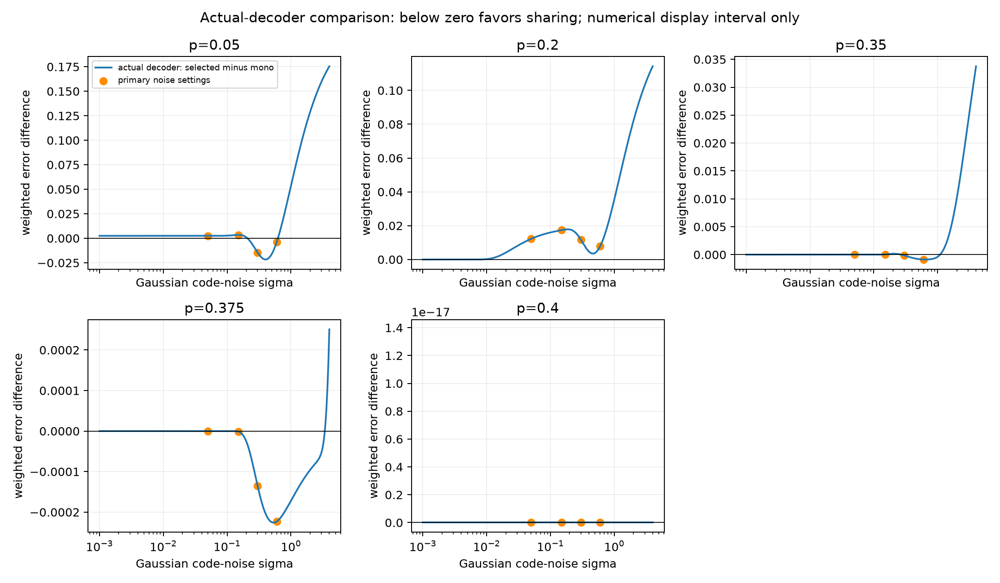

# Finite frequency verification: observed results

6 October 2026. The five-case verification ran only after the independent
mathematics approval saved in `../math/teacher_review.md`. The fixed protocol,
source snapshots and approval are archived before calculation within `run_v1`.
No training, extra frequency, geometry grid or optimizer campaign was run.

## Clean storage selection

The separately proved transition is

`pc=(3-sqrt(5))/2 = 0.3819660112501051518`.

Below it, the reviewed theorem establishes opposite-sign sharing; above it,
the important concept alone is retained. To obtain the particular selected
geometry below the transition, the present calculation exhaustively compared
the finite rational bias/geometry candidates for each prescribed frequency.

| p | Certification method | Energy in important concept | Energy in weak concept | Selected clean weighted MSE | Mono retaining important concept MSE |
|---|---|---:|---:|---:|---:|
| .05 | Strict global value-interval separation | .704626318713 | .295373681287 | .0177428805413461 | .0237500000000000 |
| .20 | Strict global value-interval separation | .836509434571 | .163490565429 | .0777520825162943 | .0800000000000000 |
| .35 | Strict global value-interval separation | .997404872784 | .002595127216 | .1137405821908572 | .1137500000000000 |
| .375 | Strict global value-interval separation | .999878432177 | .000121567823 | .1171874027176620 | .1171875000000000 |
| .40 | Reviewed above-transition global mono theorem | 1 | 0 | .1200000000000000 | .1200000000000000 |

Every below-transition case has strict separation of the winning value interval
from all other feasible distinct candidate intervals and both mono endpoint
objectives. Each considered 256 joint bias branches; raw root checks numbered
1,132, 1,031, 934 and 930, respectively. All feasible and rejected roots,
constraint signs, kink/stationary bias formulas, rational value intervals and
chart endpoints are retained. The two infinite chart endpoints retain the weak
concept and have loss `p(1-p)`; the important-concept endpoint has loss
`p(1-p)/2`. No unresolved interval comparison or numerical failure occurred.

The .35 and .375 advantages in clean reconstruction are small and explicitly
retained: approximately `9.418e-6` and `9.728e-8`. They are not enlarged or
represented as a large practical gain. The discrete numerical points do not
replace the continuous transition proof.

The dashed line is the separately proved `pc`; the dots are the five reviewed
selection cases. No continuous selected-geometry curve is inferred by joining
the points. Weak concept energy approaches zero near the transition in these
samples. Close selected/mono loss points legitimately overlap at this scale;
the table and raw intervals preserve the small differences.

## Actual-decoder noisy feature detection

Below is **selected minus mono-retaining-important** weighted detection error.
Negative favors the selected code; positive favors mono. These are sums using
importance `[1,1/2]`, not divided by the total weight. Mono is selected by the
clean reconstruction objective, not retrospectively by its noise result.

| p | sigma=0 | .05 | .15 | .30 | .60 |
|---|---:|---:|---:|---:|---:|
| .05 | .002500000 | .002500003 | .003472366 | -.014474507 | -.003661119 |
| .20 | .000000000 | .012228403 | .017396880 | .011651721 | .007768999 |
| .35 | .000000000 | .000000000 | .000053058 | -.000144223 | -.000862825 |
| .375 | .000000000 | .000000000 | -.000001394 | -.000134651 | -.000222913 |
| .40 | .000000000 | .000000000 | .000000000 | .000000000 | .000000000 |

**Clean reconstruction improvement does not impose a universal detection
ordering.** At .20, the certified sharing code improves clean MSE but is worse
at every positive primary noise value. At .05, it is worse at low noise and
better at .30 and .60. At .35 and .375, the observed advantages are much smaller.
At .40, selected and mono are identical, so their differences are exactly zero.

Both actual and centered-midpoint detectors, both mono controls, all per-feature
FP/FN rates and continuous decoder MSE are saved in `run_v1/primary_risks.csv`.
The midpoint detector produces materially different comparisons and cannot
replace an unfavorable actual-decoder result. Zero entries at very low positive
noise may be numerical saturation of Gaussian probabilities rather than an
exact-sign proof. Geometry is algebraically certified but risk values use
float64 Gaussian CDF evaluation.

## Display curves and numerical crossings

Exactly 240 prescribed log-spaced sigma values from .001 to 4 were evaluated for
each of the five selected codes. All 1,200 plotted rows are saved. The six Brent
crossings below were checked only in existing display brackets with reliably
opposite endpoint signs; none required a new frequency or geometry.

| p | Display bracket | Numerical crossing sigma | Absolute residual |
|---|---|---:|---:|
| .05 | [.202265237925, .209407692086] | .207955194061 | 6.94e-18 |
| .05 | [.614052399279, .635736012140] | .625275337437 | 2.34e-14 |
| .35 | [.266988340173, .276416317026] | .269886292551 | 2.08e-17 |
| .35 | [1.069910683345, 1.107691708353] | 1.093276590070 | 8.33e-17 |
| .375 | [.124429088475, .128822967867] | .127739699426 | 5.22e-19 |
| .375 | [3.362815865706, 3.481564684927] | 3.397147335355 | 2.78e-17 |

All six root calculations converged. No crossing was found for .20 on this
display interval; no reliably negative difference was observed, and tiny-noise
zeros can reflect finite-precision saturation. At .40 the codes are
identical rather than having isolated crossings. The count is **not a
completeness theorem**: roots outside the range or near numerically unreliable
signs may be missed. The display does not justify a single monotone robustness
boundary. Numerically it shows intermediate noise regions where sharing wins
for some frequencies, followed by regions where mono wins again.

For a fixed genuinely mixed code, the independently reviewed large-noise limit
is selected risk `3/4` versus mono `1/2+p/2`, yielding difference `1/4-p/2>0`.
This is consistent with eventual return to a mono advantage. It does not imply
that such a winning sharing region must exist at every frequency, or that its
two endpoints are unique.

## Records and inspection

- Total runtime: 46.74 seconds. No extra cases or retries.
- 48 archived file hashes checked; all match.
- 150 primary detector/model/noise rows; 1,200 display rows; six numerical roots.
- Both plots were visually inspected: labels are readable and data values are
  not clipped. The zero .40 risk panel has a tiny Matplotlib auto-axis range
  (roughly 1e-17); every saved difference in that panel is exactly zero. It is
  a display quirk, not a nonzero effect.
- Settings, environment, source/protocol/review snapshots, full certificate
  branches, rejected/feasible roots, interval comparisons, selected weights,
  primary risks, display values, crossing diagnostics and hashes are in `run_v1`.

Root's independent teacher review is saved separately in
`../review/teacher_review.md` and passed after an explicitly logged quadrature
checker repair; no raw scientific output was changed.
This is a fixed-load, fixed-importance clean storage theorem plus finite noisy
detection validation. Variable load, additional importance ratios, publication
novelty and real-model transfer remain unresolved.
